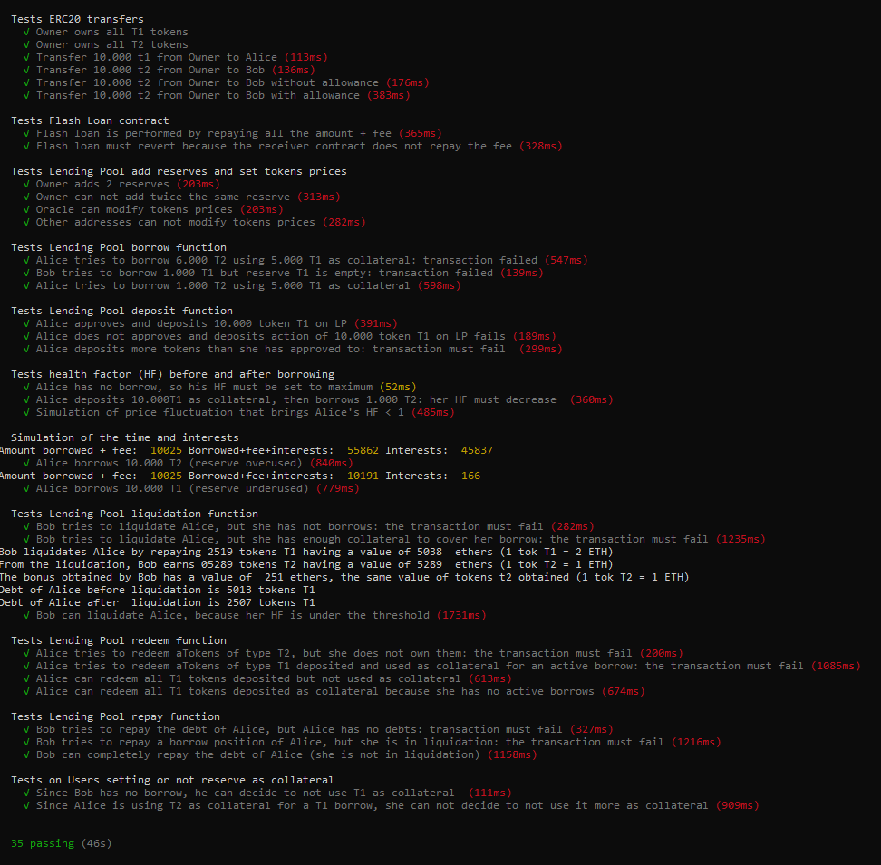

# A minimal implementation of Aave

## 1. Introduction and goal
[Aave](https://github.com/aave/aave-protocol) is a protocol of Decentralized Finance (DeFi) based on the Lending Pool (LP) concept. LPs are “virtual places” where users can deposit and borrow (paying interests) different assets sending specific transactions to a smart contract that handles them. In general, the “deposit action” has no particular constraints while the “borrow action” is subject to some requirements: the most important is that the borrower must deposit a certain amount of collateral to cover his borrowing.

Although Aave provides a wide range of functions, the goal of this work is to summarize and focus on the main functions of Aave, which are “borrow” and “deposit”, highlining when they can be executed and how they modify the state of the lending pool and the users’ balances.

## 2. Background
This section provides an overview of Lending Pools, their functionalities, and their assets.

**_Lending Pools and functionalities_**  In DeFi, a LP can be considered a smart contract towards which users can send transactions in order to lend and borrow crypto-assets, trusting the contract without a central entity. In general, a LP contains different reserves represented by other smart contracts handling these assets. 
On the one hand, users that deposit their assets increase the liquidity of the reserve (and so of the LP), on the other hand, this liquidity can be borrowed by other users that must deposit – in the lending pool – collateral to cover their borrows. 

**_Collateralization_**  A collateral is an amount of crypto-asset that a user must deposit in the Lending Pool as security for his loans. A borrower can open many loans, the only constraint is that he has enough collateral. For this purpose, the health factor is used in order to establish if he can borrow anymore or if his position can be liquidated. The health factor is a parameter that depends on the user’s total borrows, the user’s total collateral, and on token’s price.

A borrow position of a user can be liquidated when the health factor is under a particular threshold (typically 1). In a liquidation scenario, a liquidator repays a part of a user's borrow, he receives a part of the collateral of the user under liquidation and a bonus (typically in percentage).

When a loan is completely repaid by the borrower (amount to borrow + interests), the Lending Pool returns the amount deposited as collateral.

**_Interests_** Interests are an amount of crypto-asset that lenders receive for their deposits and borrowers must return for their borrows. In both cases, interests depend on the interest rate that is influenced by the utilization of the reserve as follows:
- when the reserve is underused (i.e. a lot of liquidity is available) interest rate for borrowers decreases because LP wants to incentivize users to borrow, and interests for lenders decrease to disincentivize depositing;
- when the reserve is overused (i.e. liquidity is scarce) interest rate for borrowers increases, and lenders are incentivized to deposit assets by high-interest rate in order to provide more liquidity.

**_Tokens_** Tokens play a central role in DeFi and in Lending Pools. A token is a crypto-asset having value and living in a blockchain. Tokens can be minted, transferred, and exchanged both in Decentralized Exchanges (DEX) and in other contracts handling them. LPs can handle tokens, they sometimes are minted in order to keep track of users’ actions or to redeem them.

## 3. Tools used
This work is written in Solidity, and it is composed of four smart contracts:
- [LendingPool.sol](https://github.com/enricopiseddu/lendingPool/blob/main/LendingPool.sol), the main contract. It is the core of this work: it defines the borrow and deposit functions and other functions used by them
- [ERC20.sol](https://github.com/enricopiseddu/lendingPool/blob/main/ERC20.sol) is the contract that defines the ERC20 Token. Its interface is the [IERC20.sol](https://github.com/enricopiseddu/lendingPool/blob/main/IERC20.sol)
- [Ownable.sol](https://github.com/enricopiseddu/lendingPool/blob/main/Ownable.sol) is the contract from which LendingPool.sol inherits: it defines the “owner” of the lending pool that is the only address that can configure it.
- Finally, the library [WadRayMath.sol](https://github.com/enricopiseddu/lendingPool/blob/main/WadRayMath.sol) provides multiplications and divisions for wads and rays, respectively decimal numbers with 18 and 27 digits. Its usage is necessary because the language handles only integer numbers.

These smart contracts are developed thanks to [Remix IDE](https://remix.ethereum.org/) and [Metamask](https://metamask.io/).

## 4. Main features of this work

The work proposed is called “ProtoAave”. It is a minimal prototype of Aave original implementation that proposes minimal actions (mostly deposit and borrow actions) in order to understand how the state of the Lending Pool changes in response to specific transactions sent by users.

The following subchapters focus mainly on actors and their actions towards the Lending Pool contract of this work. All formulas that calculate interest rates, health factor, the amount of collateral needed to open a new borrow position, etc, have been taken from the original Aave's implementation.


### 4.1 Actors

There are different actors involved in this work. All of them are represented by addresses and are:

- the “owner” of the Lending Pool: it is the address that deploys the contract. The owner can add a reserve (that is a contract that handles a particular ERC20 token) to the lending pool and initializes it, settings some parameters;

- the “price Oracle”, an address set by the “owner” that can modify ERC20 tokens’ price;

- users: they are addresses that mostly call the borrow and the deposit functions, manage their collateral, and query the Lending Pool in order to view its state.

### 4.2 Borrow function
The borrow function is summarized by the follow pseudocode:

```
borrow (address reserve, uint256 amountToBorrow){
	require(amountToBorrow > 0)
	require(LiquidityOfLendingPool >= amountToBorrow)
	Compute User Data //(total liquidity, collateral, borrows, LoanToValue, …, HF)
	require(HF > threshold) // threshold is tipically = 1
	Compute the fee (0.0025%) for the amountToBorrow 
	require(fee > 0)
	Compute needed collateral to cover the borrows
	require(user’s collateral >= collateral needed)
	Update the state of Lending Pool on borrow action
	Transfer to msg.sender the amountToBorrow required
}
```

The borrow function takes two parameters in input: the address of the reserve (that is the address of the contract handling the ERC20 token) from which the user (msg.sender) wants to borrow the "amountToBorrow" (the second parameter).

After checking that the amount to borrow is greater than zero and the specified reserve has enough liquidity (in terms of the number of tokens), the function computes the msg.sender's data, and in particular his health-factor (HF). The HF is a value calculated as the ratio of collateral deposited versus the amount borrowed: if HF<1, the loans of a user can be liquidated and so he can not borrow other assets.

After checking that user's HF is greater than 1, the function computes the fee, a fixed interest that is 0.0025% of the amount to borrow. As in Aave, the function checks that the fee is not zero.

According to the user's data calculated before, the function computes the minimum collateral needed to cover the user's borrows (including this amount to borrow). The collateral needed is a value depends on user's total borrows (including the current amount to borrow), his fees and his Loan-To-Value.

After checking that user has enough collateral, the function updates the state of the reserve (interest rates and timestamps). Finally, it transfers the number of _amountToBorrow_ tokens to the user, thanks to the Transfer method of the ERC20 contract.

#### 4.2.1 Differences between borrow functions
This section focuses on the differences between Aave’s borrow function and the borrow function proposed in this work, respectively called “ABF” and “PBF”.

- First difference regards the input parameters. Beyond the reserve’s address and the amount to borrow, ABF contains two additional parameters: the interest rate mode (that can be set variable or stable) and an integer called “referralCode”, a program consisting of a 20% fee-share.

- Unlike PBF, the ABF can be called only on active, unfreezed and enabled for borrows reserves. These checks are made mostly thanks to modifiers.

- In ABF, the available liquidity of the reserve is calculated by the ["Core"](https://github.com/aave/aave-protocol/blob/master/contracts/lendingpool/LendingPoolCore.sol#L594) contract, and it represents the amount of ERC20 tokens owned by the Lending Pool or the amount of ETHs. In the PBF, this liquidity represents only the amount of ERC20 tokens (thanks to “balanceOf” method of ERC20 contract), because this implementation does not allow borrowing ETHs.

- In ABF, both users’ data and the collateral needed to cover a borrow position are computed by the [“Data Provider”](https://github.com/aave/aave-protocol/blob/master/contracts/lendingpool/LendingPoolDataProvider.sol) contract, while the [“Fee Provider”](https://github.com/aave/aave-protocol/blob/master/contracts/fees/FeeProvider.sol) contract provides fee calculus. In the PBF, these computations are made by the "Lending Pool" contract, using the same formulas proposed in Aave but with different data structures.

- The last difference regards an additional [portion of code](https://github.com/aave/aave-protocol/blob/master/contracts/lendingpool/LendingPool.sol#L469), in ABF, executed when the msg.sender wants to borrow at a stable rate. This part of code checks if the reserve is enabled for stable borrows, if msg.sender is allowed to borrow a stable rate, and the maximum amount msg.sender can borrow at a stable rate, that is 25% of the reserve’s available liquidity.


### 4.3 Deposit function
The deposit function is summarized by the follow pseudocode:
```
deposit (address reserve, uint256 amountToDeposit, bool useAsCollateral){
	require(amount > 0)
	require(msg.sender allows the deposit) //allowance method of ERC20
	Transfer the amount to Lending Pool
	Mint an amount of aTokens
	Update the state of the reserve
	Eventually set user uses this reserve as collateral
}
```

The deposit function is more simple and short. It takes in input three parameters: the reserve in which the user (that is the msg.sender) wants to deposit, the amount to deposit and a boolean indicating if the user uses the reserve as collateral's deposit.

After checking that the amount to deposit is greater than zero, the function checks if the user allowed the Lending Pool to withdraw the amount, thanks to the "allowance" function of ERC20 contract.

Now, the Lending Pool calls the "TransferFrom" method of ERC20 contract, that transfers the amount from the msg.sender to the lending pool.
An amount of "amountToDeposit" of aTokens are minted for the user. These aTokens provide the user can redeem them in the future.

Finally, the function updates interest rates and timestamps for the reserve and keeps track in a data structure if the user wants to use the reserve as collateral.


#### 4.3.1 Differences between borrow functions
This section focuses on the differences between Aave’s deposit function and the deposit function proposed in this work, respectively called “ADF” and “PDF”.

- First difference regards input parameters. Both functions accept the address of the reserve and an integer value representing the amount to deposit. The ADF takes another parameter called referral code (the same parameter indicated in 4.2.1), while the PDF takes a different parameter: a boolean indicating if _msg.sender_ wants his deposit in the reserve as collateral. 

- In both implementations, after depositing, an number of aTokens are minted for the _msg.sender_. These tokens keep track of how much a certain user has deposited in the reserve. In ADF aTokens are managed by a smart contract called ["AToken"](https://github.com/aave/aave-protocol/blob/master/contracts/tokenization/AToken.sol), while in the PDF these tokens are stored in a double mapping called "aTokens" having type (address=>address=>uint256).

- In the ADF, when the _msg.sender_ deposits in a reserve for the first time, the Lending Pool considers this deposit as collateral. On the contrary, in the PDF the _msg.sender_ must indicate if wants to use the reserve as collateral or not, storing that in a particular data structure.

- In the PDP, before the Lending Pool transfers the amount of tokens from the _msg.sender_ to its address, it checks (thanks to "allowance" method of ERC20) if _msg.sender_ has allowed this transfer. In the ADP this check is not executed. 

### 4.4 Repay function
The repay function is summarized by the follow pseudocode:
```
repay (address reserve, uint256 amountToRepay, address userToRepay){
	require(userToRepay has HF > threshold)
	require(userToRepay has an actove loan in the reserve)
	require(amountToRepay == debit of user to repay)
	require(msg.sender approves the LP to transfer the amountToRepay)
	Update state on repay action
	Transfer the assets from msg.sender to LP
}
```

The repay function takes as input three parameters: the address of the reserve to repay, the amount to repay, and the user having a pending borrow.
Firstly, the function checks the user's health factor is above the threshold (i.e. the user must not be under liquidation) and the user has an active borrow in the reserve. Next, it checks that the amountToRepay is equal to the debt (amount borrowed + fee + interests) of the userToRepay and if the msg.sender has allowed the Lending Pool to withdraw the amount to repay.
If all these checks are satisfied, the function updates the state of the lending pool and the user, and finally it transfers the amount to repay from the msg.sender to the reserve of the LP.

When the repay function is successfully executed, the userToRepay's health factor increases allowing him to redeem the value of the collateral used in the loan just repaid. 

#### 4.4.1 Differences between repay functions
The main difference between the repay function proposed in this work and the original implementation in Aave, is that in the proposed implementation it is possible only repay completely the debt, while in Aave the msg.sender can repay also only a part of it. 
In both implementations, the caller (msg.sender) can repay the debt of another user specifying the address, or the own debt specifying his address.


### 4.5 Redeem function
The redeem function is summarized by the follow pseudocode:
```
redeemAllTokens (address reserve){
	amountToRedeem = Get the amount to redeem (including interests accrued) for the msg.sender
	require(amountToRedeem > 0)
	require(msg.sender's Health Factor > threshold, after redeem action)
	Burn the aTokens of msg.sender
	Reset the index of msg.sender (used for computing interests)
	require(LP reserve balance >= amountToRedeem)
	Update state of the reserve on redeem action
	Transfer the amountToRedeem to msg.sender
}
```

The redeem function takes as input one parameter: the address of the reserve from which the msg.sender want to redeem his tokens previously deposited.
Firstly, the function fetches the amount of aTokens for the reserve and computes the interests accrued: the sum of these values is called "amountToRedeem".
Next, it checks if the amountToRedeem is greater than zero and if the msg.sender's health factor is above the threshold (after the redeem action). Last check is verifying the LP reserve has enough liquidity to allow the msg.sender to redeem his tokens.
If these checks pass, the function burns the msg.sender's aTokens, it resets the user index (used for computing accrued interests) and modifies the state of the reserve by updating the new interest rate according to the new balance.
Finally, the function directly transfers the amountToRedeem to the msg.sender.

When a user decides to redeem his tokens from a reserve, if these tokens are not used as collateral then the user's health factor does not change, else it changes and the redeem action is correctly executed only if the health factor does not drop under a threshold.

#### 4.5.1 Differences between redeem functions
The main difference between the function proposed in this implementation and the original implementation of Aave, is that in this implementation it is possible only to redeem all tokens of a reserve, while in Aave it is possible to specify the amount to redeem (by passing to the function ad additional parameter).

Another difference is that in Aave is possible to redirect the accrued interests on aTokens towards a particular address, while in this implementation the accrued interests are cumulated in the owner user of aTokens.


### 4. Functions for computing users' data
All of these functions can be called by everyone. For each function, its signature is proposed, and a brief comment on how it works. All of these functions are very similar to Aave's implementation because they mostly compute data with specific formulas. The only differences are the data structures used: in this work, there are two main structures holding reserve and user's data, while in Aave's implementation data are held by different smart contracts.
<hr />

```
function calculateUserGlobalData(address user) returns(uint256, uint256, uint256, uint256, uint256, uint256, uint256)
```

- Given a user, it returns 7 parameters: his total liquidity (deposited in all reserves), his total collateral, his total borrows, his total fees, his current Loan to value,  his liquidation threshold and its health factor.
<hr />

```
function calculateHealthFactorFromBalancesInternal(uint256 collateral, uint256 borrow, uint256 fee, uint256 liquidationThreshold)
```

- This function computes the health factor of a user. The health factor depends on user’s collateral, his borrow, his fee and his liquidation threshold.
<hr />

```
function getCompoundedBorrowBalance(address user, address reserve) returns(uint256)
```

- Given a user and a reserve, it returns the amount of user's tokens (borrowed+fee+interests) for the reserve. This amount is called "compounded borrow balance".
<hr />

```
function getUserBasicReserveData(address user, address reserve) returns(uint256, uint256, uint256, bool)
```

- Given a user and a reserve, it returns 4 parameteres: the amount of aTokens (minted), the compounded borrow balance, the fee and a boolean indicating if user uses the reserve as collateral 
<hr />


```
function getUserBorrowBalances(address user, address reserve) returns(uint256, uint256, uint256)
```

- Given a user and a reserve, it returns 3 parameters: the amount (borrowed+fee), the amount (borrowed+fee+interests) and the interests.
<hr />


### 4. Other functions called by users, the oracle and the owner
<hr />

```
function setPrice(address reserve, uint256 price) onlyOracle
```
- Only the oracle can set tokens’ prices.

In Aave's implementation, this function does not exist. In this work, it simulates the concept of Oracle which can modify the price of the tokens of a reserve.

<hr />

```
function addReserve(address reserve)
```
- This function allows the creation of a new reserve with default data. The only input parameter is the address of the contract ERC20 that handles tokens. Only the owner can add a reserve.

In Aave's implementation, the creation of a reserve is made by the ["LendingPoolConfiguration"](https://github.com/aave/aave-protocol/blob/master/contracts/lendingpool/LendingPoolConfigurator.sol) contract and by the methods "initReserve" and "initReserveWithdata". The Lending Pool configuration contract allows also to modify some reserve's parameter (i.e. Liquidation Threshold, decimals...).


<hr />

```
function calculateCollateralNeededInETH(address reserve, uint256 amount, uint256 fee, uint256 userBorrows, uint256 userFees, uint256 userLTV) returns(uint256)
```

- This function returns the collateral needed (in ETH) to cover the borrows (new amount to borrow + actual userBorrows). It can be called by everyone.
<hr />

```
function setUserUseReserveAsCollateral(address reserve, bool useAsCollateral)
```

- This function allows the user (the msg.sender) to set if he uses the reserve as collateral. This function can abort if the user’s collateral makes his health factor under a given threshold
<hr />

```
function balanceDecreaseAllowed(address reserve, address user, uint256 amount) returns(bool)
```

- This function returns true if an eventual decrease of a user’s collateral is allowed. It can be called by everyone.
<hr />


### 4. Functions for interests and interest rates calculus.
In general, interests for a single borrow depend on the time passing, on the amount borrowed and on the interest rate.

The interest rate for a reserve depends on:
- the utilization rate, defined as the ratio between the total borrows and the available liquidity
- the optimal utilization rate, set to 80% for all reserves.

Both Aave and this work compute time as difference between block timestamps.

The follow functions provide the interests and interest rate calculus:
```
function updateIndexes(address reserve)
function calculateLinearInterest(uint256 rate, uint256 lastUpdateTimestamp) return(uint256)
function calculateCompoundedInterest(uint256 rate, uint256 lastUpdateTimestamp) return(uint256)
function calculateInterestRates(uint256 availableLiquidity, uint256 totalBorrows) return(uint256 currentLiquidityRate, uint256 currentVariableBorrowRate)
```

## 5. Evaluation
In this section, some experiments are proposed, in order to verify the correctness of transactions. 
These experiments involve the main smart contract called “Lending Pool” and the other two contracts representing two types of ERC20 tokens.

In this evaluation phase, the following tools are used:
- Typescript language
- the libraries [“waffle-ethereum”](https://getwaffle.io/) and [“ethers”](https://docs.ethers.org/v5/) are used in order to simulate and interact with the blockchain
- the library [“chai”](https://www.chaijs.com/) for assertion tests. 

Tests regards the main features proposed in ProtoAave, and are aggregated [here](https://github.com/enricopiseddu/lendingPool/tree/main/waffle_testing/test).

### 5.1 Tests for ERC20 contracts
**_Test initialization_** The owner deploys two ERC20 contracts called T1 and T2 and assigns to each 10.000 tokens. All tokens are assigned to the deployer (=owner).

**_Proposed tests_**
Tests for ERC20 contract verify these conditions:
- It checks if the owner owns 10.000 T1 tokens and 10.000 t2 tokens
- The owner directly transfers 10.000 T1 to Alice, then checks if Alice’s T1 balance is 10.000
- The owner directly transfers 10.000 T2 to Bob, then checks if Bob’s T2 balance is 10.000
- The owner tries to transfer 10.000 T2 to Bob without allowance, the transaction must fail and balances must not change.
- The owner tries to transfer 10.000 T2 to Bob after the allowance action, transaction must be executed and balances must change. If the owner tries to transfer twice with a single allowance action, the second transfer must fail;


### 5.2 Tests for Lending Pool contract
In the following tests, when not specified, all tokens' prices are equal and are set to 1 ETH = 1 token. 

<hr />

#### 5.2.1 Adding reserves and setting prices. 
**_Initialization_**  The owner deploys two contracts representing ERC20 tokens (T1 and T2), then deploys the Lending Pool and sets a particular address as price oracle.

**_Proposed tests_**
Tests are:
- The owner adds the two reserves of ERC20 tokens, then checks if these reserves are correctly added.
- The owner adds a reserve to the LP, then tries to add the same reserve: the transaction must fail because the reserve already exists in LP
- The owner adds a reserve in LP. The price oracle modifies the price of the token handled by that reserve. The price must be updated.
- The owner adds a reserve in LP. An address (not the oracle) tries to modify the token price handled by that reserve. The transaction must fail.

<hr />


#### 5.2.2 Deposit function
**_Initialization_**   The owner deploys a contract representing a token "T1" ERC20 with an initial balance of 10.000. Next, the owner transfers to Alice all 10.000 T1 tokens. Finally, the owner deploys the Lending Pool contranct and adds the token T1.

**_Proposed tests_**
Tests are:
- Alice allows LP to deposit 10.000 T1. She deposits 10.000 T1 to the Lending Pool. Then, the LP balance of T1 must be 10.000 and Alice's T1 balance must be zero.
- Alice does not approve the deposit of 10.000 T1 in LP. When she tries to deposit 10.000 T1, the transaction must revert and balances must not change.
- Alice allows LP to deposit 5.000 T1. When she tries to deposit more (e.g. 6.000 T1), the transaction must revert and balances must not change.

<hr />

#### 5.2.3 Borrow function
**_Initialization_**   The owner deploys two contracts representing ERC20 tokens: "T1" and "T2" with an initial balance of 10.000 each one. Next, the owner adds T1 and T2 in the LP, he distributes 10.000 T1 to Alice and 10.000 T2 to Bob. Finally Bob deposits all his T2 tokens to the Lending Pool.

**_Proposed tests_**
Tests are:
- Alice deposits 5.000 T1 as collateral, then she tries to borrow 6.000 T2. The transaction must revert because her collateral does not cover the amount to borrow.
- Bob tries to borrow 1.000 T1, but the reserve T1 is empty. The transaction must revert.
- Alice deposits 5.000 T1 as collateral, then she borrows 1.000 T2. After the transaction, Alice's T2 balance must be 1.000, LP's T1 balance must be 9.000 (10.000 - 1.000).

<hr />

#### 5.2.4 Health factor tests
**_Initialization_**   The owner deploys the LP and two contracts representing ERC20 tokens: "T1" and "T2" with an initial balance of 10.000 each one. Next, the owner adds T1 and T2 to the LP, he distributes 10.000 T1 to Alice and 10.000 T2 to Bob. Finally, Bob deposits all his T2 tokens to the Lending Pool not as collateral, while Alice deposits all her T1 tokens as collateral

**_Proposed tests_**
Tests are:
- Alice has no borrows, so her health factor must be set to maximum (2^256 -1, the greatest integer representable in Solidity)
- Alice decides to borrow 1.000 T1. After the borrow action, her health factor must decrease with respect to the previous value.
- Alice decides to borrow 1.000 T1 when the price of T1 and T2 (her collateral) are equal (set to 1 token = 1 ETH). Then, the T1 price increases from 1 to 20: this fluctuation must bring Alice's health factor under the liquidation threshold (=1.)

<hr />

#### 5.2.5 Tests on setting reserves as collateral
**_Initialization_**   The owner deploys the LP and two contracts representing ERC20 tokens: "T1" and "T2" with an initial balance of 10.000 each one. Next, the owner adds T1 and T2 in the LP, he distributes 10.000 T1 to Bob and 10.000 T2 to Alice. Finally, Bob deposits all his T1 tokens to the Lending Pool as collateral.

**_Proposed tests_**
Tests are:
- Since Bob has no borrows and he deposited 10.000 T1 as collateral, he can decide to set T1 reserve not more as collateral.
- Alice deposits 10.000 T2 as collateral, then she borrows 1.000 T1. If she tries to set T2 not as collateral, the transaction must revert.

<hr />


#### 5.2.6 Tests on interests and time
**_Initialization_**   The owner deploys the LP and three contracts representing ERC20 tokens: "T1", "T2" and "T3" with an initial balance of 100.000 T1, 100.000 T2 and 500.000 T3. Next, the owner adds T1, T2 and T3 to the LP, he distributes 100.000 T1 and T2 to LP and 250.000 T3 to Alice and Bob. Bob deposits 250.000 T3 as collateral and he borrows 90.000 T2 making the reserve T2 overused (utilization rate > 80%). The reserve T1 is underused because it has no borrows.

**_Proposed tests_**
- Alice deposits 20.000 T3 as collateral, then she borrow 10.000 T2 (from the reserve OVERUSED).
- Alice deposits 20.000 T3 as collateral, then she borrow 10.000 T1 (from the reserve underused). 

After a certain amount of time, interest for T1 and T2 is shown.

The interests that Alice must pay for the borrow, must be greater for T2 tokens because the T2 reserve is OVERUSED.

<hr />

This image shows the output about tests.

<p align="center">
  
</p>

## 6. Main differences between this work and the original implementation
In order to focus on the “deposit” and “borrow” actions, this work contains some changes that do not prejudice the meaning of Aave protocol. In this section we will see these differences.

**_Asset type_**
Aave handles both ERC20 tokens and Ethers, in fact users can deposit both of them. In this work, the main smart contract handles only ERC20 tokens: Ethers are used only to compare different ERC20 tokens and assign them a value. To do this, a particular address called “oracle” can set tokens’ prices. 

In Aave's implementation, this difference notices in the [deposit function](https://github.com/aave/aave-protocol/blob/master/contracts/lendingpool/LendingPool.sol#L299) that is a _payable_ function: this allows users to deposit Ethers to the Lending Pool, specifying as "address reserve" a particular address "0xEeeeeEeeeEeEeeEeEeEeeEEEeeeeEeeeeeeeEEeE" and as "amount" the exact amount contained in _msg.value_ (the amount of ETH sent by the _msg.sender_).

**_Variable and stable borrow rate_**
When using Aave, users can decide to open a borrow position with stable or variable rate. A stable rate ensures users expect (almost exactly) how much they will pay in interests. A variable rate is a rate that adjusts according the market’s offer and demand. In particular, it depends on the actual and the optimal utilization rate of the reserve and some constants. In this work, only variable borrow rate is used because the implementation of a stable borrow rate requires a continuous rebalancing process for each user.

In Aave's implementation, this difference notices in the [borrow function](https://github.com/aave/aave-protocol/blob/master/contracts/lendingpool/LendingPool.sol#L388). This function takes in input an integer called "interestRateMode": this parameter set to zero indicates that the _msg.sender_ wants to borrow at a stable rate, and set to 1 at a variable rate.

**_Lending Pool configuration_**
In Aave it is possible to configure each reserve, in particular, each of them can be actived, freezed and enabled as collateral. An active and unfreezed reserve accepts deposits and borrows, while a freezed reserve accepts only repay and liquidation actions. These actions, in Aave, can be executed by a smart contract called [“Lending Pool Configurator”](https://github.com/aave/aave-protocol/blob/master/contracts/lendingpool/LendingPoolConfigurator.sol). In this work, these actions are unnecessary because once a reserve is added, it is ready to accept deposits (also as collateral) and borrows actions.


## 7. Conclusions
In this work, we have seen an overview of Lending Pools, how users can use them in order to handle their crypto-assets (ERC20 tokens in this case), and how Lending Pools help users in lending and borrowing actions without explicitly trusting each other, but trusting the smart contract that handles the LP.
ProtoAave has been developed and has been proposed as a minimal implementation of Aave Protocol. 

It has highlighted when and how the deposit and borrow action can be executed, how users can manage their collaterals according to their health factors, and how interests for borrowers depend on time and on the utilization rate of a reserve.

This work differs from the original implementation of Aave, and differences have been shown. In the evaluation phase, some experiments have been shown using different libraries and including different cases in order to demonstrate the correctness of transactions. 
