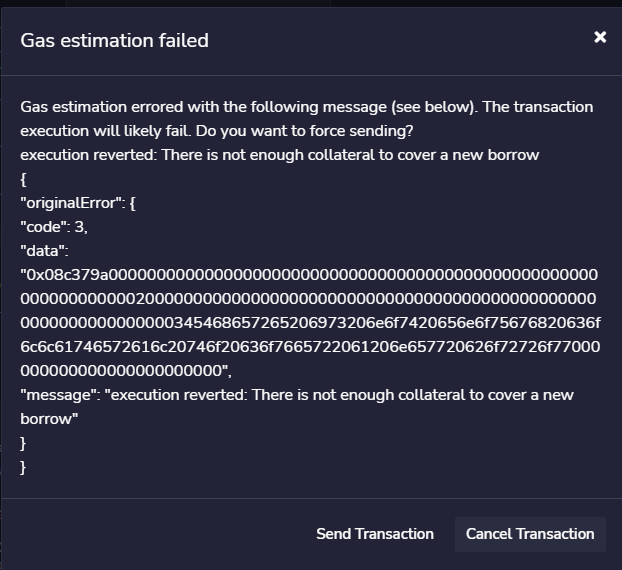
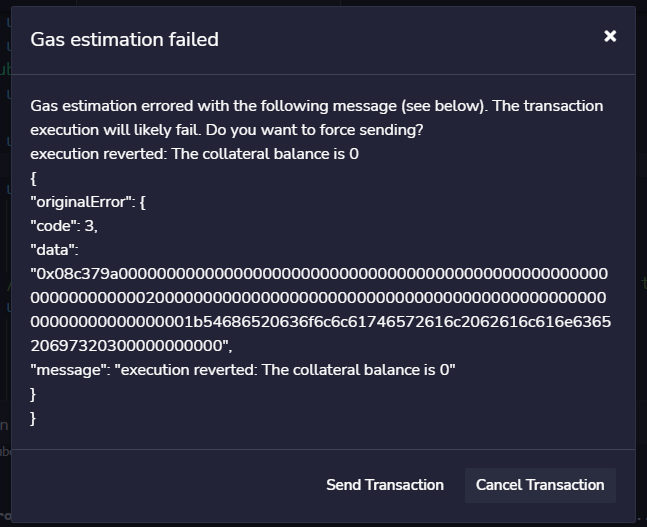
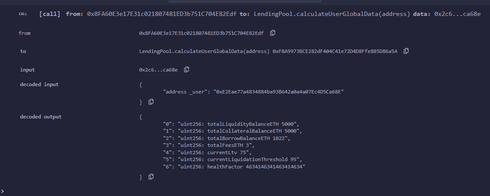

# A minimal implementation of Aave

## 1. Introduction and goal
[Aave](https://github.com/aave/aave-protocol) is a protocol of Decentralized Finance (DeFi) based on the Lending Pool (LP) concept. LPs are “virtual places” where users can deposit and borrow (paying interests) different assets sending specific transactions to a smart contract that handles them. In general, the “deposit action” has no particular constraints while the “borrow action” is subject to some requirements: the most important is that the borrower must deposit a certain amount of collateral to cover his borrowing.

Although Aave provides a wide range of functions, the goal of this work is to summarize and focus on the main functions of Aave, that are “borrow” and “deposit”, highlining when they can be executed and how they modify the state of the lending pool and the users’ balances.

## 2. Background
This section provides an overview of Lending Pools, their functionalities, and their assets.

**_Lending Pools and functionalities_**  In DeFi, a LP can be considered a smart contract towards which users can send transactions in order to lend and borrow crypto-assets, trusting the contract without a central entity. In general, a LP contains different reserves represented by other smart contracts handling these assets. 
On the one hand, users that deposit their assets increase the liquidity of the reserve (and so of the LP), on the other hand, this liquidity can be borrowed by other users that must deposit – in the lending pool – collateral to cover their borrows. 

**_Collateralization_**  A collateral is an amount of crypto-asset that a user must deposit in the Lending Pool as security for his loans. A borrower can open many loans, the only constraint is that he has enough collateral. For this purpose, the health factor is used in order to establish if he can borrow anymore or if his position can be liquidated. The health factor is a parameter that depends on the user’s total borrows, the user’s total collateral, and on token’s price.

A borrow position of a user can be liquidated when the health factor is under a particular threshold (typically 1). In a liquidation scenario, a liquidator repays a part of a user's borrow, he receives a part of the collateral of the user under liquidation and a bonus (typically in percentage).

When a loan is completely repaid by the borrower (amount to borrow + interests), the Lending Pool returns the amount deposited as collateral.

**_Interests_** Interests are an amount of crypto-asset that lenders receive for their deposits and borrowers must return for their borrows. In both cases, interests depend on the interest rate that is influenced by the utilization of the reserve as follows:
- when the reserve is underused (i.e. a lot of liquidity is available) interest rate for borrowers decreases because LP wants to incentivize users to borrow, and interests for lenders decrease to disincentivize depositing;
- when the reserve is overused (i.e. liquidity is scarce) interest rate for borrowers increases, and lenders are incentivized to deposit assets by high-interest rate in order to provide more liquidity.

**_Tokens_** Tokens play a central role in DeFi and in Lending Pools. A token is a crypto-asset having value and living in a blockchain. Tokens can be minted, transferred, and exchanged both in Decentralized Exchanges (DEX) and in other contracts handling them. LPs can handle tokens, they sometimes are minted in order to keep track of users’ actions or to redeem them.

## 3. Tools used
This work is written in Solidity, and it is composed of four smart contracts:
- [LendingPool.sol](https://github.com/enricopiseddu/lendingPool/blob/main/LendingPool.sol), the main contract. It is the core of this work: it defines the borrow and deposit functions and other functions used by them
- [ERC20.sol](https://github.com/enricopiseddu/lendingPool/blob/main/ERC20.sol) is the contract that defines the ERC20 Token. Its interface is the [IERC20.sol](https://github.com/enricopiseddu/lendingPool/blob/main/IERC20.sol)
- [Ownable.sol](https://github.com/enricopiseddu/lendingPool/blob/main/Ownable.sol) is the contract from which LendingPool.sol inherits: it defines the “owner” of the lending pool that is the only address that can configure it.
- Finally, the library [WadRayMath.sol](https://github.com/enricopiseddu/lendingPool/blob/main/WadRayMath.sol) provides multiplications and divisions for wads and rays, respectively decimal numbers with 18 and 27 digits. Its usage is necessary because the language handles only integer numbers.

These smart contracts are developed thanks to [Remix IDE](https://remix.ethereum.org/) and [Metamask](https://metamask.io/).

## 4. Main features of this work

The work proposed is called “ProtoAave”. It is a minimal prototype of Aave original implementation that proposes minimal actions (mostly deposit and borrow actions) in order to understand how the state of the Lending Pool changes in response to specific transactions sent by users.

The following subchapters focus mainly on actors and their actions towards the Lending Pool contract of this work. All formulas that calculate interest rates, health factor, the amount of collateral needed to open a new borrow position, etc, have been taken from the original Aave's implementation.


### 4.1 Actors

There are different actors involved in this work. All of them are represented by addresses and are:

- the “owner” of the Lending Pool: it is the address that deploys the contract. The owner can add a reserve (that is a contract that handles a particular ERC20 token) to the lending pool and initializes it, settings some parameters;

- the “price Oracle”, an address set by the “owner” that can modify ERC20 tokens’ price;

- users: they are addresses that mostly call the borrow and the deposit functions and query the Lending Pool in order to view its state.

### 4.2 Borrow function
The borrow function is summarized by the follow pseudocode:

```
borrow (address reserve, uint256 amountToBorrow){
	require(amountToBorrow > 0)
	require(LiquidityOfLendingPool >= amountToBorrow)
	Compute User Data //(total liquidity, collateral, borrows, LoanToValue, …, HF)
	require(HF > threshold) // threshold is tipically = 1
	Compute the fee (0.0025%) for the amountToBorrow 
	require(fee > 0)
	Compute needed collateral to cover the borrows
	require(user’s collateral >= collateral needed)
	Update the state of Lending Pool on borrow action
	Transfer to msg.sender the amountToBorrow required
}
```

The borrow function takes two parameters in input: the address of the reserve (that is the address of the contract handling the ERC20 token) from which the user (msg.sender) wants to borrow the "amountToBorrow" (the second parameter).

After checking that the amount to borrow is greater than zero and the specified reserve has enough liquidity (in terms of the number of tokens), the function computes the msg.sender's data, and in particular his health-factor (HF). The HF is a value calculated as the ratio of collateral deposited versus the amount borrowed: if HF<1, the loans of a user can be liquidated and so he can not borrow other assets.

After checking that user's HF is greater than 1, the function computes the fee, a fixed interest that is 0.0025% of the amount to borrow. As in Aave, the function checks that the fee is not zero.

According to the user's data calculated before, the function computes the minimum collateral needed to cover the user's borrows (including this amount to borrow). The collateral needed is a value depends on user's total borrows (including the current amount to borrow), his fees and his Loan-To-Value.

After checking that user has enough collateral, the function updates the state of the reserve (interest rates and timestamps). Finally, it transfers the number of _amountToBorrow_ tokens to the user, thanks to the Transfer method of the ERC20 contract.

#### 4.2.1 Differences between borrow functions
This section focuses on the differences between Aave’s borrow function and the borrow function proposed in this work, respectively called “ABF” and “PBF”.

- First difference regards the input parameters. Beyond the reserve’s address and the amount to borrow, ABF contains two additional parameters: the interest rate mode (that can be set variable or stable) and an integer called “referralCode”, a program consisting of a 20% fee-share.

- Unlike PBF, the ABF can be called only on active, unfreezed and enabled for borrows reserves. These checks are made mostly thanks to modifiers.

- In ABF, the available liquidity of the reserve is calculated by the ["Core"](https://github.com/aave/aave-protocol/blob/master/contracts/lendingpool/LendingPoolCore.sol#L594) contract, and it represents the amount of ERC20 tokens owned by the Lending Pool or the amount of ETHs. In the PBF, this liquidity represents only the amount of ERC20 tokens (thanks to “balanceOf” method of ERC20 contract), because this implementation does not allow borrowing ETHs.

- In ABF, both users’ data and the collateral needed to cover a borrow position are computed by the [“Data Provider”](https://github.com/aave/aave-protocol/blob/master/contracts/lendingpool/LendingPoolDataProvider.sol) contract, while the [“Fee Provider”](https://github.com/aave/aave-protocol/blob/master/contracts/fees/FeeProvider.sol) contract provides fee calculus. In the PBF, these computations are made by the "Lending Pool" contract, using the same formulas proposed in Aave but with different data structures.

- The last difference regards an additional [portion of code](https://github.com/aave/aave-protocol/blob/master/contracts/lendingpool/LendingPool.sol#L469), in ABF, executed when the msg.sender wants to borrow at a stable rate. This part of code checks if the reserve is enabled for stable borrows, if msg.sender is allowed to borrow a stable rate, and the maximum amount msg.sender can borrow at a stable rate, that is 25% of the reserve’s available liquidity.


### 4.3 Deposit function
The deposit function is summarized by the follow pseudocode:
```
deposit (address reserve, uint256 amountToDeposit, bool useAsCollateral){
	require(amount > 0)
	require(msg.sender allows the deposit) //allowance method of ERC20
	Transfer the amount to Lending Pool
	Mint an amount of aTokens
	Update the state of the reserve
	Eventually set user uses this reserve as collateral
}
```

The deposit function is more simple and short. It takes in input three parameters: the reserve in which the user (that is the msg.sender) wants to deposit, the amount to deposit and a boolean indicating if the user uses the reserve as collateral's deposit.

After checking that the amount to deposit is greater than zero, the function checks if the user allowed the Lending Pool to withdraw the amount, thanks to the "allowance" function of ERC20 contract.

Now, the Lending Pool calls the "TransferFrom" method of ERC20 contract, that transfers the amount from the msg.sender to the lending pool.
An amount of "amountToDeposit" of aTokens are minted for the user. These aTokens provide the user can redeem them in the future.

Finally, the function updates interest rates and timestamps for the reserve and keeps track in a data structure if the user wants to use the reserve as collateral.


#### 4.3.1 Differences between borrow functions
This section focuses on the differences between Aave’s deposit function and the deposit function proposed in this work, respectively called “ADF” and “PDF”.

- First difference regards input parameters. Both functions accept the address of the reserve and an integer value representing the amount to deposit. The ADF takes another parameter called referral code (the same parameter indicated in 4.2.1), while the PDF takes a different parameter: a boolean indicating if _msg.sender_ wants his deposit in the reserve as collateral. 

- In both implementations, after depositing, an number of aTokens are minted for the _msg.sender_. These tokens keep track of how much a certain user has deposited in the reserve. In ADF aTokens are managed by a smart contract called ["AToken"](https://github.com/aave/aave-protocol/blob/master/contracts/tokenization/AToken.sol), while in the PDF these tokens are stored in a double mapping called "aTokens" having type (address=>address=>uint256).

- In the ADF, when the _msg.sender_ deposits in a reserve for the first time, the Lending Pool considers this deposit as collateral. On the contrary, in the PDF the _msg.sender_ must indicate if wants to use the reserve as collateral or not, storing that in a particular data structure.

- In the PDP, before the Lending Pool transfers the amount of tokens from the _msg.sender_ to its address, it checks (thanks to "allowance" method of ERC20) if _msg.sender_ has allowed this transfer. In the ADP this check is not executed. 


### 4.4 Functions for computing users' data
All of these functions can be called by everyone. For each function, its signature is proposed, and a brief comment on how it works. All of these functions are very similar to Aave's implementation because they mostly compute data with specific formulas. The only differences are the data structures used: in this work, there are two main structures holding reserve and user's data, while in Aave's implementation data are held by different smart contracts.
<hr />

```
function calculateUserGlobalData(address user) returns(uint256, uint256, uint256, uint256, uint256, uint256, uint256)
```

- Given a user, it returns 7 parameters: his total liquidity (deposited in all reserves), his total collateral, his total borrows, his total fees, his current Loan to value,  his liquidation threshold and its health factor.
<hr />

```
function calculateHealthFactorFromBalancesInternal(uint256 collateral, uint256 borrow, uint256 fee, uint256 liquidationThreshold)
```

- This function computes the health factor of a user. The health factor depends on user’s collateral, his borrow, his fee and his liquidation threshold.
<hr />

```
function getCompoundedBorrowBalance(address user, address reserve) returns(uint256)
```

- Given a user and a reserve, it returns the amount of user's tokens (borrowed+fee+interests) for the reserve. This amount is called "compounded borrow balance".
<hr />

```
function getUserBasicReserveData(address user, address reserve) returns(uint256, uint256, uint256, bool)
```

- Given a user and a reserve, it returns 4 parameteres: the amount of aTokens (minted), the compounded borrow balance, the fee and a boolean indicating if user uses the reserve as collateral 
<hr />


```
function getUserBorrowBalances(address user, address reserve) returns(uint256, uint256, uint256)
```

- Given a user and a reserve, it returns 3 parameters: the amount (borrowed+fee), the amount (borrowed+fee+interests) and the interests.
<hr />


### 4.5 Other functions called by users, the oracle and the owner
<hr />

```
function setPrice(address reserve, uint256 price) onlyOracle
```
- Only the oracle can set tokens’ prices.

In Aave's implementation, this function does not exist. In this work, it simulates the concept of Oracle which can modify the price of the tokens of a reserve.

<hr />

```
function addReserve(address reserve)
```
- This function allows the creation of a new reserve with default data. The only input parameter is the address of the contract ERC20 that handles tokens. Only the owner can add a reserve.

In Aave's implementation, the creation of a reserve is made by the ["LendingPoolConfiguration"](https://github.com/aave/aave-protocol/blob/master/contracts/lendingpool/LendingPoolConfigurator.sol) contract and by the methods "initReserve" and "initReserveWithdata". The Lending Pool configuration contract allows also to modify some reserve's parameter (i.e. Liquidation Threshold, decimals...).


<hr />

```
function calculateCollateralNeededInETH(address reserve, uint256 amount, uint256 fee, uint256 userBorrows, uint256 userFees, uint256 userLTV) returns(uint256)
```

- This function returns the collateral needed (in ETH) to cover the borrows (new amount to borrow + actual userBorrows). It can be called by everyone.
<hr />

```
function setUserUseReserveAsCollateral(address reserve, bool useAsCollateral)
```

- This function allows the user (the msg.sender) to set if he uses the reserve as collateral. This function can abort if the user’s collateral makes his health factor under a given threshold
<hr />

```
function balanceDecreaseAllowed(address reserve, address user, uint256 amount) returns(bool)
```

- This function returns true if an eventual decrease of a user’s collateral is allowed. It can be called by everyone.
<hr />


### 4.6 Functions for interests and interest rates calculus.
In general, interests for a single borrow depend on the time passing, on the amount borrowed and on the interest rate.

The interest rate for a reserve depends on:
- the utilization rate, defined as the ratio between the total borrows and the available liquidity
- the optimal utilization rate, set to 80% for all reserves.

Both Aave and this work compute time as difference between block timestamps.

The follow functions provide the interests and interest rate calculus:
```
function updateIndexes(address reserve)
function calculateLinearInterest(uint256 rate, uint256 lastUpdateTimestamp) return(uint256)
function calculateCompoundedInterest(uint256 rate, uint256 lastUpdateTimestamp) return(uint256)
function calculateInterestRates(uint256 availableLiquidity, uint256 totalBorrows) return(uint256 currentLiquidityRate, uint256 currentVariableBorrowRate)
```

## 5. Evaluation
In this section, a small experiment is proposed, in order to verify the correctness of transactions. 

This experiment involves the main smart contract called “Lending Pool” and the other two contracts representing two types of ERC20 tokens. All of these contracts are deployed on the Goerli Testnet, and it is possible to verify all their transactions in the Goerli explorer at [https://goerli.etherscan.io](https://goerli.etherscan.io)

Addresses of users, involved in this experiment, that send transactions to the contracts:
- The user “Owner” of Lending Pool, token T1 and token T2, defined as the address that deploys these contracts: [0x8FA60E3e17E31c021807481ED3b751C704E82Edf](https://goerli.etherscan.io/address/0x8FA60E3e17E31c021807481ED3b751C704E82Edf)
- The user called “Alice”: [0xE2Eae77a4834884ba93B642a0a4a07Ec4D5Ca68E](https://goerli.etherscan.io/address/0xE2Eae77a4834884ba93B642a0a4a07Ec4D5Ca68E)
- The user called “Bob”: [0x8A7E8F3FfFE9D8DdF733c9183f19Ee0Ea78d1EB2](https://goerli.etherscan.io/address/0x8A7E8F3FfFE9D8DdF733c9183f19Ee0Ea78d1EB2)

**_Configuration before evaluation_**

First of all, the Owner deploys the LP contract, T1 contract and T2 contract.

Addresses of deployed contracts:			
- Lending Pool (LP) at [0xF8A9973BCE282dF404C41e72D4D8Ffe885D86a5A](https://goerli.etherscan.io/address/0xF8A9973BCE282dF404C41e72D4D8Ffe885D86a5A)
- ERC20 token (T1) at [0x050EDF9417862A3aa4Ca84cD199f1F0540E0df07](https://goerli.etherscan.io/address/0x050EDF9417862A3aa4Ca84cD199f1F0540E0df07)
- ERC20 token (T2) at [0x10c2f1cCF6EeE9cA707228BfD5cD4F124D2C2a9C](https://goerli.etherscan.io/address/0x10c2f1cCF6EeE9cA707228BfD5cD4F124D2C2a9C)


Then, the owner executes these transactions:
- he distributes 10.000 tokens T1 to Alice [(transaction link)](https://goerli.etherscan.io/tx/0xac4b9941db9212cc1d500f9109c2de043fa039ff0ed78b7a6e13d9f6e4a6ea7c)
- he distributes 10.000 tokens T2 to Bob [(transaction link)](https://goerli.etherscan.io/tx/0xe4153c021bd292ac63f41b28364b2218dee29a648c1520e03ddfe8f8b22c4258)
- he adds to the LP contract two reserves corresponding to T1 token and T2 token, with default parameters (e.g. price of 1 Token = 1 ETH) [(transaction link)](https://goerli.etherscan.io/tx/0x5709e82364f88da737d8c264cd6a6f7ba1c0d860fa5be59acba3f7a22644c073) [(transaction link)](https://goerli.etherscan.io/tx/0x63165a64b153ea483bc5a4a654a13df6d6d525c24ff9ba8b8b035eb1385db7bb)


**_Proposed scenario for the borrow and deposit evaluation_**

Alice and Bob are two users using the Lending Pool that handles T1 and T2 tokens. On one hand, Alice has 10.000 T1 out of the Lending Pool and she wants to borrow some T2 tokens, and on the other hand, Bob has 10.000 T2 out of the Lending Pool and he wants to deposit all his tokens.

At this moment, the balances of users and the LP are:

| 	      | T1	    | T2	|
| ----------- | ----------- |-----------|
| Alice       | 10.000       |	0	|
| Bob	      | 0        |	10.000	|
| Lending Pool| 0        |	0	|


Before Alice borrows T2 tokens, she deposits, in the LP, 5.000 tokens T1 as collateral. Next, Bob decides to lend all his T2 tokens to the LP.

Alice’s transactions: 
- She approves (in ERC20 T1 contract) that the LP transfers 5.000 T1 from her to LP itself [(transaction link)](https://goerli.etherscan.io/tx/0xd12ada5e38e6e6db66f473714aedc360a5ff42bef62e22686f1ff51dc718b71b)
- She calls the “deposit” method of LP, specifying to deposit 5.000 T1 as collateral [(transaction link)](https://goerli.etherscan.io/tx/0x18a6cd7aa654d71e31286c1b0702c91c55b006db4d5a88b38c18f3490038fe4a)

Bob’s transactions:
- He approves (in the ERC20 T2 contract) that the LP transfers 10.000 T2 from him to LP itself [(transaction link)](https://goerli.etherscan.io/tx/0x97797e139105c52f9c2f52179273f9bbcb756477f9e7f7b05c140038c44d28a7)
- He calls the “deposit” method of LP, specifying to deposit 10.000 T2 not as collateral [(transaction link)](https://goerli.etherscan.io/tx/0x639db9a1c2084c6e619769b45e557fbceac3bbcba650ff7b66f4f08a1eb50ae1)

After these 4 transactions, the state of balances is the follows:


| 	      | T1	    | T2	|
| ----------- | ----------- |-----------|
| Alice       |5.000      |	0	|
| Bob	      | 0        |	0	|
| Lending Pool| 5.000        |	10.000	|


At this point, Alice tries to borrow 4.000 T2, but she can’t because his collateral does not cover the borrow: the collateral minimum to borrow 4.000 T2 depends mostly on the actual Loan-To-Value of the user, which is 75%. So, the collateral minimum needed is about 5.333 T1 > 5.000 T1. As soon as Alice tries to send the transaction for borrowing, the IDE Remix alerts her that the transaction will be reverted with the appropriate message error:


<p align="center">
  
</p>

In a second attempt, Alice tries to borrow 1.000 T2 by calling the “borrow” method, and the transaction [(transaction link)](https://goerli.etherscan.io/tx/0x0b63f59f2e9ef55dff95230a027b7c7005dd912658120d09d821f2fbbfa6a016) is correctly executed: she receives 1.000 tokens T2 from the LP. Now, the balances of users and LP are:

| 	      | T1	    | T2	|
| ----------- | ----------- |-----------|
| Alice       |5.000      |	1.000	|
| Bob	      | 0        |	0	|
| Lending Pool| 5.000        |	9.000	|


At this point, Bob – that has deposited 10.000 T1 not as collateral – tries to borrow 1.000 T2. When he sends the transaction, the IDE Remix tells us that he can not borrow because he has zero collateral:


<p align="center">
  
</p>


**_Query the health factor_**

These types of transactions, that are “view”, are not recorded in the blockchain but it is possible to see them in the Remix IDE.
To view the health factor of any user, anyone can call the function “calculateUserGlobalData” passing in input the user’s address.

The follow image proposes the response to this call, executed on Alice’s address:

<p align="center">
  
</p>


Since Alice had deposited 5.000 T1 as collateral and then borrowed 1.000 T2, his health factor drops from the maximum integer representable to 4,63. This value depends on her collateral, borrows + fees, and liquidation threshold. 

The follow image proposes the response to this call, executed on Bob’s address:

<p align="center">
  
</p>

Since Bob has no borrow pending, his health factor is very high: it is set to 2^256 -1, the maximum integer representable.

**_Setting reserves used as collateral_**

Any user can decide to use a reserve as collateral. The only constraint is that the user had deposited some liquidity in that reserve.

For example, Bob has deposited 10.000 tokens T2, so he can set the reserve that handles T2 as collateral [(transaction link)](https://goerli.etherscan.io/tx/0xbd9c85f7ed79540f60893bcdd3126e7a8444cb2a7b164b70d11a28bb77000929) and because, at the moment, he has no borrows (and  the health factor is above a threshold), he can decide to not more use that reserve as collateral.

On the contrary, Alice has an active borrow of 1.000 T2 against a collateral deposit of 5.000 T1. At the moment, the LP does not allow Alice disables this reserve as collateral, because if it allowed her, her health factor would drop to zero, having zero collateral. When she tries to disable the reserve as collateral, the IDE Remix alerts her with an appropriate message:

<p align="center">
  
</p>

## 6. Main differences between this work and the original implementation
In order to focus on the “deposit” and “borrow” actions, this work contains some changes that do not prejudice the meaning of Aave protocol. In this section we will see these differences.

**_Asset type_**
Aave handles both ERC20 tokens and Ethers, in fact users can deposit both of them. In this work, the main smart contract handles only ERC20 tokens: Ethers are used only to compare different ERC20 tokens and assign them a value. To do this, a particular address called “oracle” can set tokens’ prices. 

In Aave's implementation, this difference notices in the [deposit function](https://github.com/aave/aave-protocol/blob/master/contracts/lendingpool/LendingPool.sol#L299) that is a _payable_ function: this allows users to deposit Ethers to the Lending Pool, specifying as "address reserve" a particular address "0xEeeeeEeeeEeEeeEeEeEeeEEEeeeeEeeeeeeeEEeE" and as "amount" the exact amount contained in _msg.value_ (the amount of ETH sent by the _msg.sender_).

**_Variable and stable borrow rate_**
When using Aave, users can decide to open a borrow position with stable or variable rate. A stable rate ensures users expect (almost exactly) how much they will pay in interests. A variable rate is a rate that adjusts according the market’s offer and demand. In particular, it depends on the actual and the optimal utilization rate of the reserve and some constants. In this work, only variable borrow rate is used because the implementation of a stable borrow rate requires a continuous rebalancing process for each user.

In Aave's implementation, this difference notices in the [borrow function](https://github.com/aave/aave-protocol/blob/master/contracts/lendingpool/LendingPool.sol#L388). This function takes in input an integer called "interestRateMode": this parameter set to zero indicates that the _msg.sender_ wants to borrow at a stable rate, and set to 1 at a variable rate.

**_Lending Pool configuration_**
In Aave it is possible to configure each reserve, in particular, each of them can be actived, freezed and enabled as collateral. An active and unfreezed reserve accepts deposits and borrows, while a freezed reserve accepts only repay and liquidation actions. These actions, in Aave, can be executed by a smart contract called [“Lending Pool Configurator”](https://github.com/aave/aave-protocol/blob/master/contracts/lendingpool/LendingPoolConfigurator.sol). In this work, these actions are unnecessary because once a reserve is added, it is ready to accept deposits (also as collateral) and borrows actions.


## 7. Conclusions
In this work, we have seen an overview of Lending Pools, how users can use them in order to handle their crypto-assets, and how Lending Pools help users in lending and borrowing actions without explicitly trusting each other, but trusting the smart contract that handles the LP. 

ProtoAave has been developed and proposed as a minimal implementation of Aave Protocol. It has highlined when and how the deposit and borrow action can be executed, and how they modify the state of the LP – for example interest rates and users’ balances.

This work differs to the original implementation of Aave, and differences have been shown.
In the evaluation phase, an experiment has been shown with references to transactions recorded in the Goerli Testnet.
